# Website asset guide

You do not need to know where Codex put an asset. Start with the words or
section you see on the website, find that row below, and use the registry key
to identify it. Every file used by the site is named in
[`src/data/assets.json`](../src/data/assets.json).

## Fastest option: replace a file in place

Use this when the new asset has the same purpose as the old one.

1. In GitHub, open the folder containing the current file.
2. Choose **Add file → Upload files**.
3. Upload the replacement with the **exact same filename and extension**.
4. Commit to a new branch and open a pull request.
5. Confirm the **Asset check** passes and review the deployment preview.

This requires no code edit. Keep roughly the same shape as the old asset so
the crop still looks intentional. If a file is shared by multiple registry entries, replacing it changes every
placement using that file. To change only one placement, use the new-filename
option below.

## Safer option: upload a new file and change one registry entry

Use this when the old asset appears in more than one place, when the file type
changes, or when you want the old file to remain available.

1. Upload the new file to the appropriate folder under `public/uploads/`:
   `photos`, `video`, `graphics`, `icons`, or `social`.
2. Open [`src/data/assets.json`](../src/data/assets.json) in GitHub and click the
   pencil icon.
3. Find the registry key from the lookup table below.
4. Change only its `src` value. For example:

   ```json
   "aboutPhoto": {
     "src": "/uploads/photos/sully-and-lylah-at-home.jpg"
   }
   ```

5. Update `alt` with a short factual description of the new image. Use an
   empty string only for decorative artwork.
6. Commit to a branch, open a pull request, and check the preview.

Paths start with `/uploads/...` even though the files live inside `public/`.

## No-code handoff option: open an Asset swap issue

In GitHub, choose **Issues → New issue → Asset swap**. Pick the visible section
from the list and drag the replacement file into the form. This is the easiest
route when you know what you want changed but do not know its filename. The
issue captures enough context for a developer or Codex to make a precise change.

## Current placement lookup

| What you see | Registry key | Current file | Replacement guidance |
| --- | --- | --- | --- |
| Full logo in the header and footer | `headerFooterLogo` | `public/brand/logo-primary.svg` | Wide SVG; transparent background |
| Main home-page background photo | `homeHeroPhoto` | `public/media/sully-with-lylah.jpg` | Portrait or landscape is okay; keep the subject near center |
| Autoplay home-page hero | `homeHeroVideo` | `public/media/good-dog-days-hero.mp4` | Silent H.264 MP4, 720×960, 24 fps, fast-start, about 2 MB |
| Dog-and-sun mark over the home hero | `homeHeroMark` | `public/brand/mark-primary.svg` | SVG with transparent background |
| “Care starts with paying attention” photo | `processAttentionPhoto` | `public/uploads/photos/red-car-chew-toy.jpg` | Landscape-friendly crop |
| “The dog in front of me sets the pace” photo | `processAdaptPhoto` | `public/media/lylah-mountain-overlook.jpg` | Landscape-friendly crop |
| “Meet Sully + Lylah” / About photo | `aboutPhoto` | `public/uploads/photos/sully-and-lylah-petco.jpg` | Tall portrait works best |
| “Real days / real dogs” featured cover | `realDaysFeaturedCover` | `public/media/red-cover.png` | Tall cover artwork |
| Red story cover in site data | `redStoryCover` | `public/media/red-cover.png` | Tall cover artwork |
| Savannah story cover in site data | `savannahStoryCover` | `public/media/savannah-cover.png` | Tall cover artwork |
| Dog-and-sun mark on Services | `servicesHeroMark` | `public/brand/mark-primary.svg` | SVG with transparent background |

### Visual previews

| First Process card | Second Process card | About section | Real days cover |
| --- | --- | --- | --- |
| 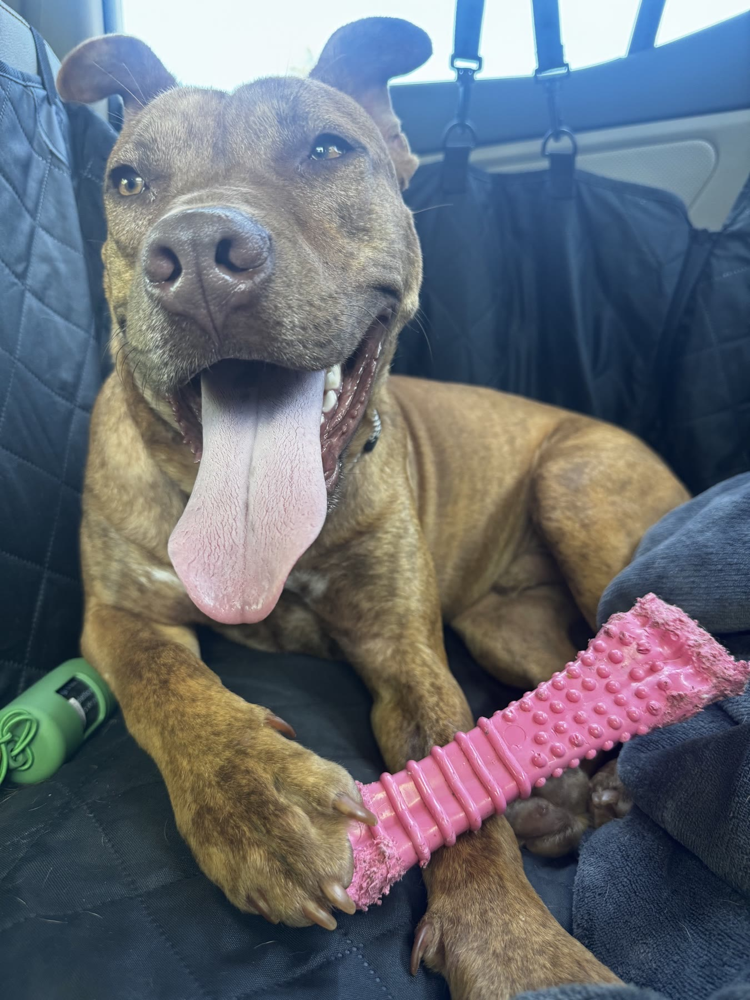 | 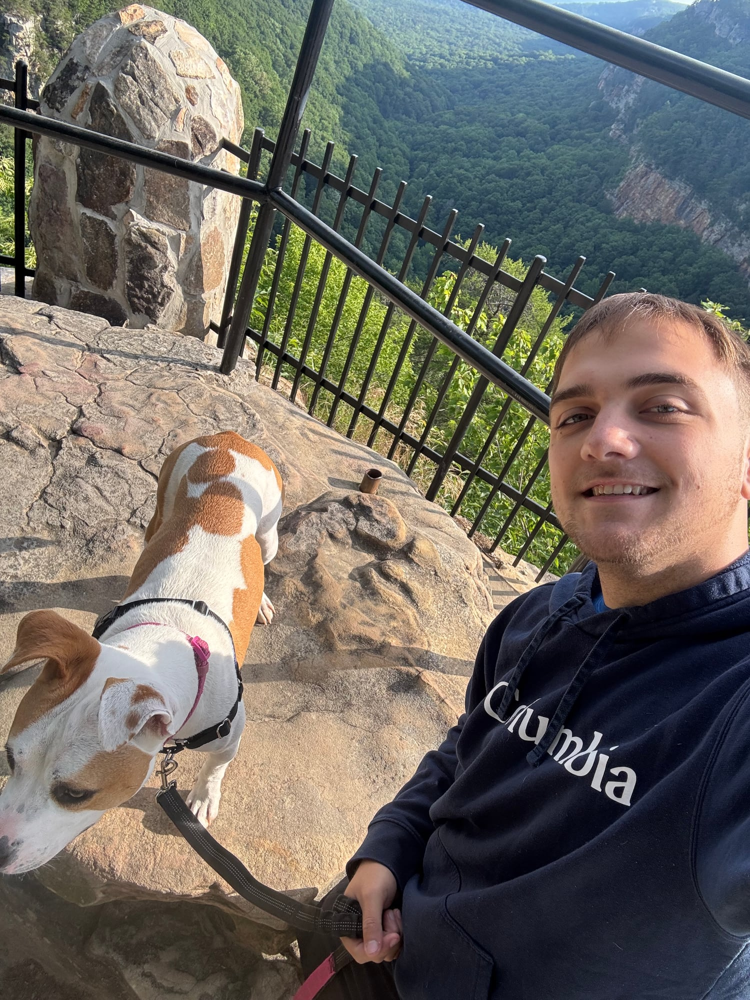 | 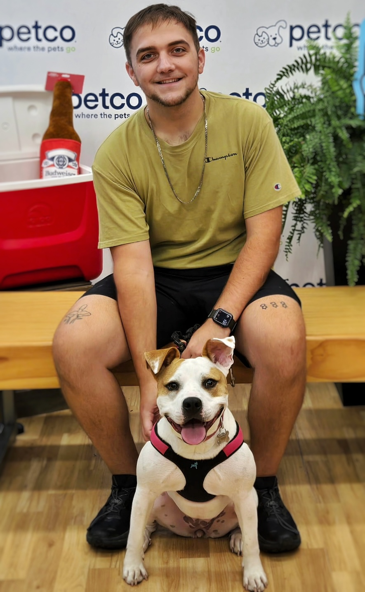 | 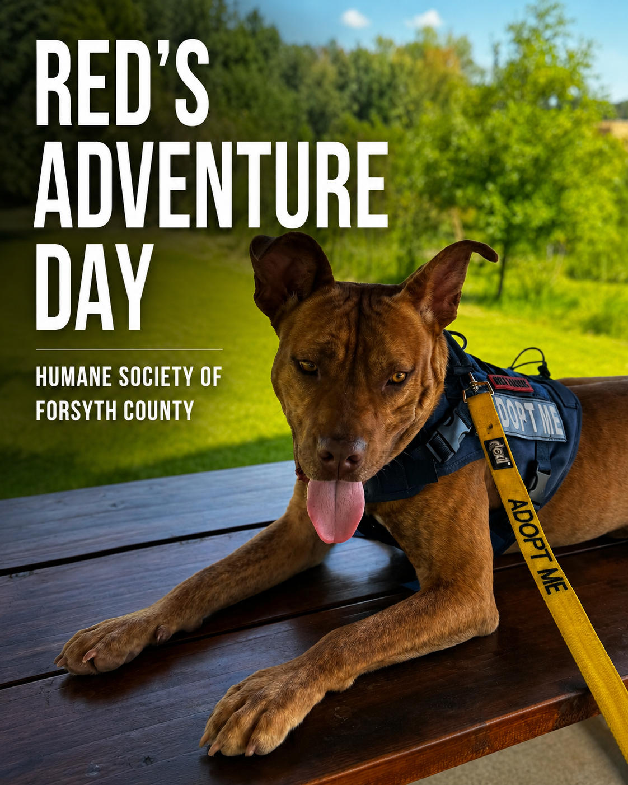 |

| Header/footer logo | Hero and Services mark | Savannah story cover |
| --- | --- | --- |
|  |  | 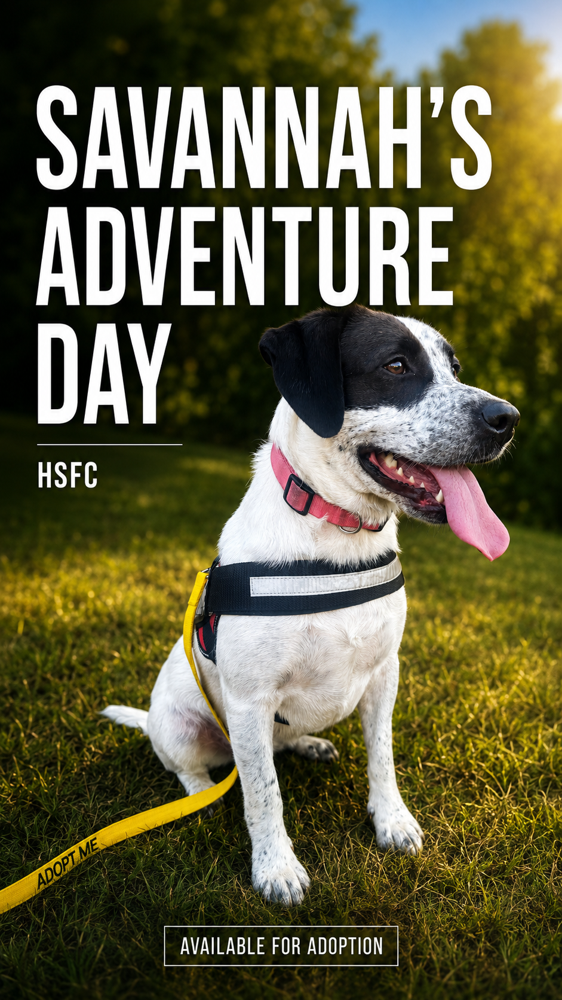 |

## Icons and metadata images

These are dedicated live upload slots. Replace the file with the same name and
no registry edit is needed.

| Purpose | Registry key | Replace this file | Recommended input |
| --- | --- | --- | --- |
| Browser tab and bookmark favicon | `browserFavicon` | `public/uploads/icons/favicon.ico` | Square, multi-size ICO |
| General app/search icon | `appIcon` | `public/uploads/icons/app-icon.png` | Square PNG, at least 256×256 |
| iPhone/iPad home-screen icon | `appleTouchIcon` | `public/uploads/icons/apple-touch-icon.png` | 180×180 PNG, no transparent edges |
| Shared social preview for all pages | `websiteShareBanner` | `public/uploads/social/gdd-banner.png` | Current approved banner: 2033×774 PNG |

All pages use the approved complete banner through `src/lib/seo.ts`. There are
no generated social-card overlays. Legacy Open Graph image URLs redirect to
this same asset through `next.config.ts`.

Social networks cache previews. After deployment, an old card may continue to
appear until that service refreshes its cache.

## Asset library: files available but not currently displayed

These are already named in the registry and can be assigned to any placement
by changing that placement's `src` and `alt` values.

| Preview | Registry key | File |
| --- | --- | --- |
|  | `brandSupportingArtwork` | `public/brand/same-good-energy.svg` |
| 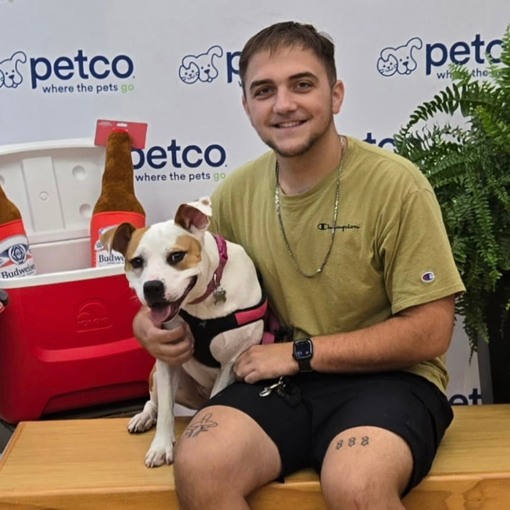 | `lylahAdoptionDayPhoto` | `public/media/lylah-adoption-day.jpg` |
| 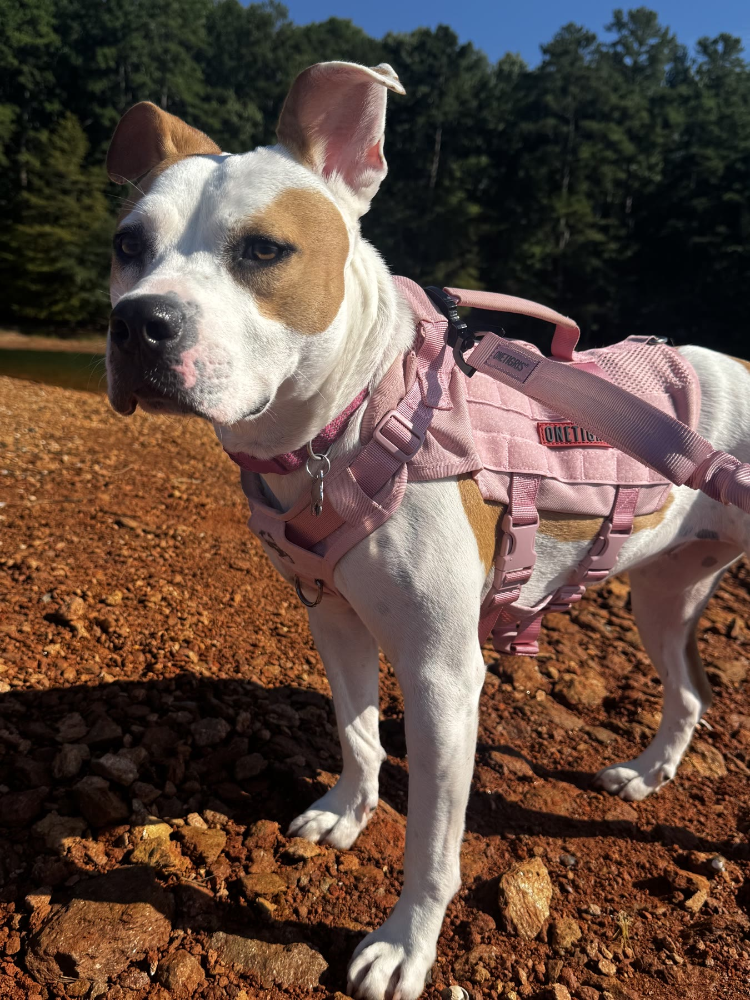 | `lylahLakePhoto` | `public/media/lylah-lake.jpg` |
| 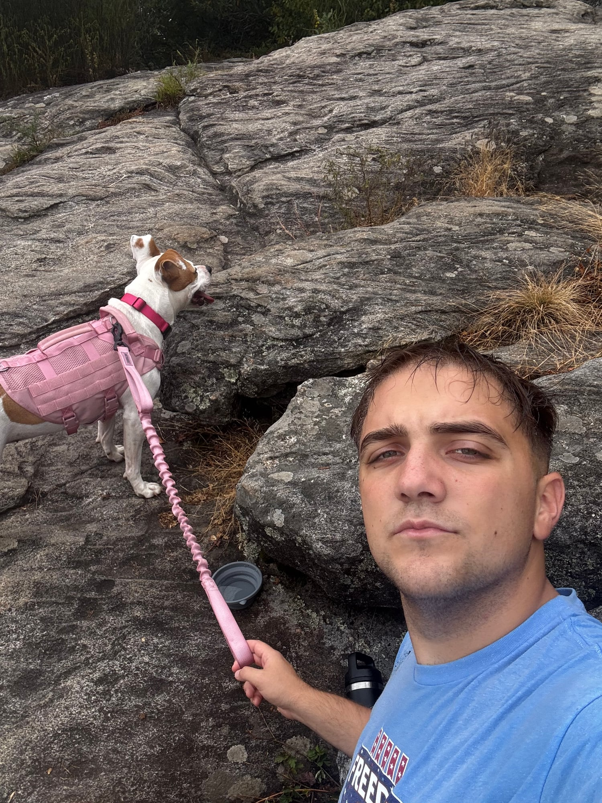 | `lylahRockTrailPhoto` | `public/media/lylah-rock-trail.jpg` |
| 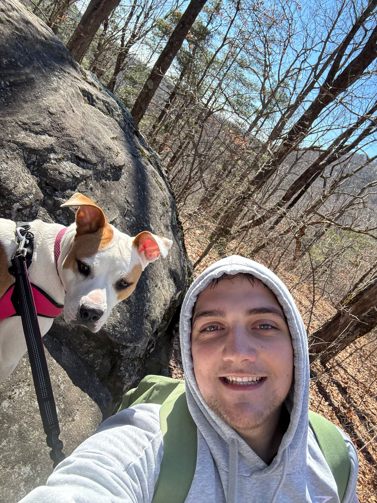 | `lylahTrailSelfiePhoto` | `public/media/lylah-trail-selfie.jpg` |
| [Overhead video of Lylah walking](../public/media/lylah-walking-above.mp4) | `lylahWalkingAboveVideo` | `public/media/lylah-walking-above.mp4` |
|  | `redPlayPhoto` | `public/media/red-play-opt.jpg` |
| 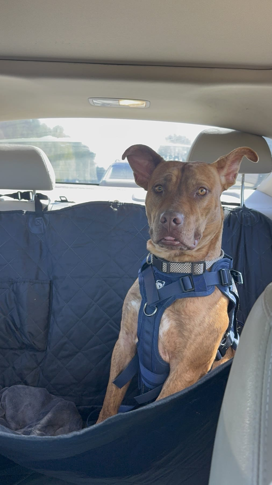 | `redPortraitPhoto` | `public/media/red-portrait-opt.jpg` |
| 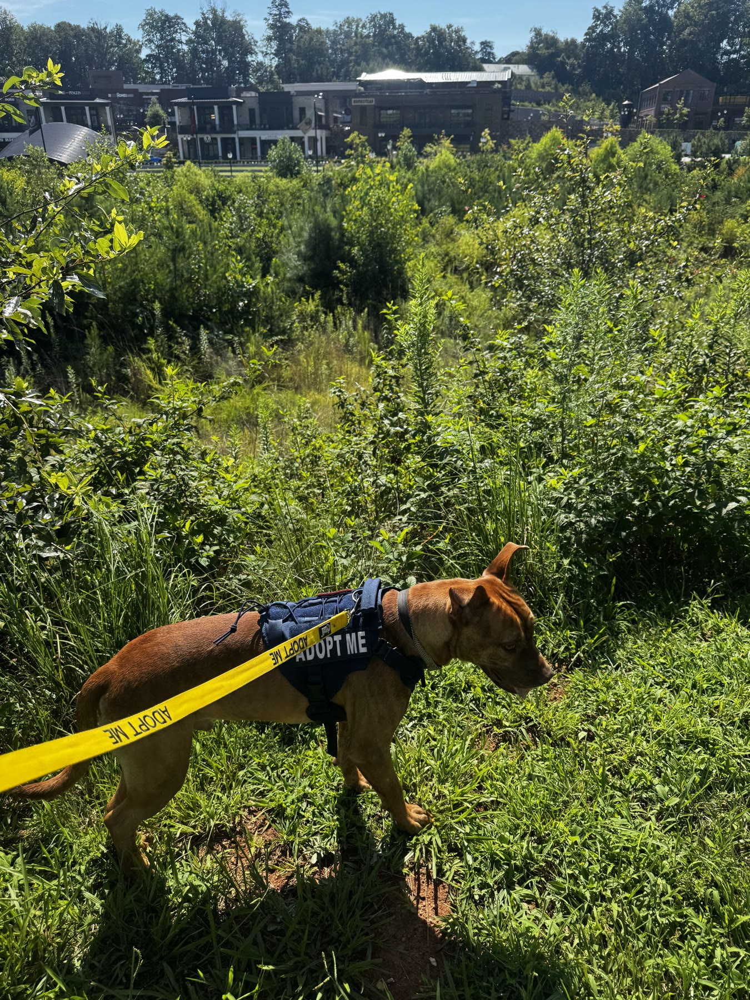 | `redTrailPhoto` | `public/media/red-trail-opt.jpg` |
| 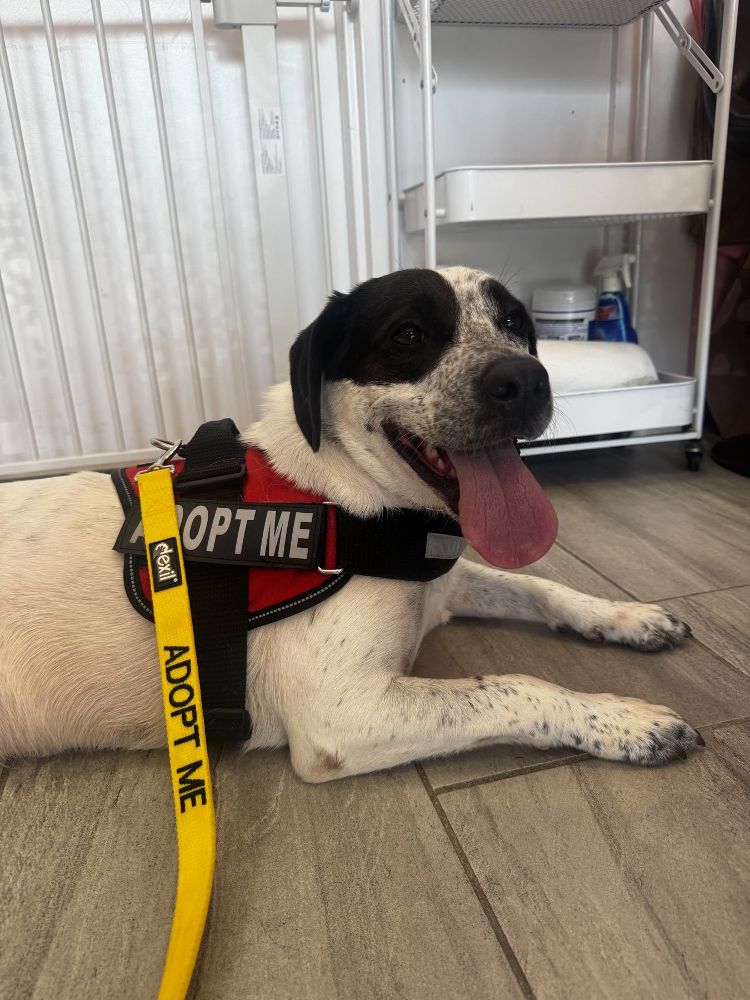 | `savannahPortraitPhoto` | `public/media/savannah-portrait-opt.jpg` |
| 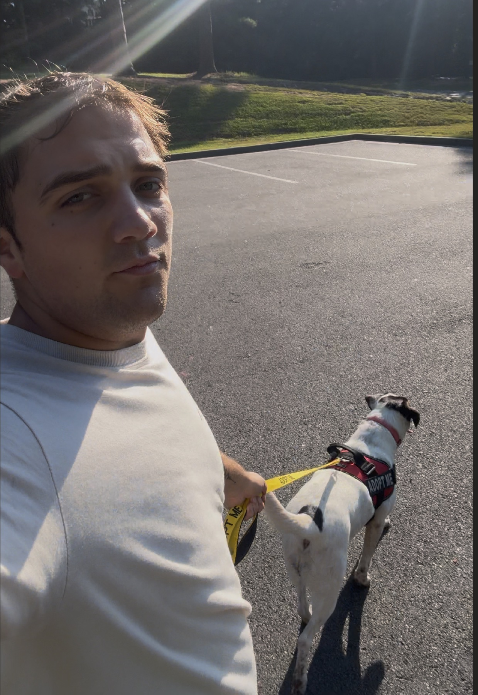 | `sullyWithSavannahPhoto` | `public/media/sully-with-savannah.jpg` |

## Graphics that are not uploaded files

Some visible graphics are HTML/CSS or generated code, so they will not appear
in the asset registry:

- The scrolling `RUN • SNIFF • SWIM...` strip is text in `src/app/page.tsx`.
- The large `CUMMING / FORSYTH` service-area graphic is text in
  `src/app/page.tsx` styled by `src/app/globals.css`.
- Plus signs, arrows, rules, colors, card shapes, and button treatments are CSS
  in `src/app/globals.css`.

If you cannot identify something, describe it using nearby words, its page,
and whether it is above or below another section. A screenshot is even better.
Codex can search those nearby words to locate the exact component.

## Local workflow

Drop a file into the appropriate `public/uploads/` folder, update its entry in
`src/data/assets.json` if the filename changed, then run:

```bash
npm run assets:check
npm run dev
```

The check fails if a registry path points to a missing file or if website code
starts hard-coding asset paths outside the registry.


### Shared link preview (current)

All pages use `websiteShareBanner` from the asset registry. The original banner
is served unchanged at `/uploads/social/gdd-banner.png`. Its dimensions are
2033×774 in `src/lib/seo.ts`; update those if replacing it with a different size.
Open Graph and Twitter use the same file. The old `/opengraph-image` and
`/services/opengraph-image` endpoints redirect to that banner. The older
`homeSharePhoto` and `servicesSharePhoto` entries are retained as library assets;
they no longer generate social cards. External services may crop or cache previews.

The original hero source remains at `public/media/good-dog-days-bgvideo.mp4` for
future edits. The site requests only the optimized `homeHeroVideo` asset.
